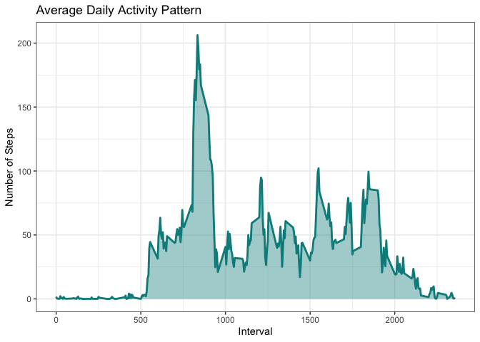

## Load required packages {.tabset}  
### Dplyr

```r
if(!require(dplyr)) {install.packages('dplyr', dependencies = TRUE)}
```

```
## Loading required package: dplyr
```

```
## 
## Attaching package: 'dplyr'
```

```
## The following objects are masked from 'package:stats':
## 
##     filter, lag
```

```
## The following objects are masked from 'package:base':
## 
##     intersect, setdiff, setequal, union
```

```r
library(dplyr)
```
### Ggplot

```r
if(!require(ggplot2)) {install.packages('ggplot2', dependencies = TRUE)}
```

```
## Loading required package: ggplot2
```

```r
library(ggplot2)
theme_set(theme_bw())
```
### KableExtra

```r
if(!require(kableExtra)) {install.packages('kableExtra', dependencies = TRUE)}
```

```
## Loading required package: kableExtra
```

```
## 
## Attaching package: 'kableExtra'
```

```
## The following object is masked from 'package:dplyr':
## 
##     group_rows
```

```r
library(kableExtra)
```
### Lubridate

```r
if(!require(lubridate)) {install.packages('lubridate', dependencies = TRUE)}
```

```
## Loading required package: lubridate
```

```
## 
## Attaching package: 'lubridate'
```

```
## The following objects are masked from 'package:base':
## 
##     date, intersect, setdiff, union
```

```r
library(lubridate)
```
## Loading and preprocessing the data


```r
activity <- read.csv(unzip('activity.zip'))
file.remove('activity.csv')
```

```
## [1] TRUE
```

```r
sapply(activity, class)
```

```
##       steps        date    interval 
##   "integer" "character"   "integer"
```

```r
activity$date <- as.Date(activity$date, '%Y-%m-%d')
head(activity) %>% kbl() %>% kable_paper('hover', full_width = F, position = 'left')
```

<table class=" lightable-paper lightable-hover" style='font-family: "Arial Narrow", arial, helvetica, sans-serif; width: auto !important; '>
 <thead>
  <tr>
   <th style="text-align:right;"> steps </th>
   <th style="text-align:left;"> date </th>
   <th style="text-align:right;"> interval </th>
  </tr>
 </thead>
<tbody>
  <tr>
   <td style="text-align:right;"> NA </td>
   <td style="text-align:left;"> 2012-10-01 </td>
   <td style="text-align:right;"> 0 </td>
  </tr>
  <tr>
   <td style="text-align:right;"> NA </td>
   <td style="text-align:left;"> 2012-10-01 </td>
   <td style="text-align:right;"> 5 </td>
  </tr>
  <tr>
   <td style="text-align:right;"> NA </td>
   <td style="text-align:left;"> 2012-10-01 </td>
   <td style="text-align:right;"> 10 </td>
  </tr>
  <tr>
   <td style="text-align:right;"> NA </td>
   <td style="text-align:left;"> 2012-10-01 </td>
   <td style="text-align:right;"> 15 </td>
  </tr>
  <tr>
   <td style="text-align:right;"> NA </td>
   <td style="text-align:left;"> 2012-10-01 </td>
   <td style="text-align:right;"> 20 </td>
  </tr>
  <tr>
   <td style="text-align:right;"> NA </td>
   <td style="text-align:left;"> 2012-10-01 </td>
   <td style="text-align:right;"> 25 </td>
  </tr>
</tbody>
</table>
## What is mean total number of steps taken per day?


```r
step_count <- activity %>% na.omit(steps) %>% group_by(date) %>% summarize(Total_steps = sum(steps))

s1 <- qplot(step_count$Total_steps, geom = 'histogram', main = 'Histogram of Total Steps per Day  ',
      xlab = 'Number of Steps', ylab = 'Count', fill = I('cyan4'), col = I('white'), alpha = I(0.4))
print(s1)
```

```
## `stat_bin()` using `bins = 30`. Pick better value with `binwidth`.
```

<!-- -->

```r
mean_step <- round(mean(step_count$Total_steps), digits = 0)
median_step <- round(median(step_count$Total_steps), digits = 0)
```
The mean of total steps per day is **10766** and the median is **10765**


## What is the average daily activity pattern?


```r
pattern <- activity %>% na.omit(steps) %>% group_by(interval) %>% summarize(Average_steps = mean(steps))
ggplot(pattern, aes(x = interval, y = Average_steps)) + geom_line(color = 'cyan4', size = 1) +
  geom_area(fill = 'cyan4', alpha = 0.4) +
  labs(x = 'Interval', y = 'Number of Steps') +
  ggtitle('Average Daily Activity Pattern')
```

<!-- -->

```r
step_max <- pattern$interval[which.max(pattern$Average_steps)]
```
Interval containing the maximum number of steps on average is **835**

## Imputing missing values


```r
na_count <- sum(is.na(activity))
```
Total NA values in the dataset is **2304**


```r
activity_filled <- activity %>% group_by(interval) %>%
  mutate(steps = case_when(is.na(steps) ~ mean(steps, na.rm=TRUE),
                           TRUE~as.numeric(steps)))
#activity_filled <- activity %>% group_by(interval) %>%
  #mutate(across(steps, ~case_when(is.na(.) ~ mean(., na.rm = TRUE), TRUE ~ as.numeric(.))))
#activity_filled <- activity %>% group_by(interval) %>%
  #mutate(steps = if_else(is.na(steps), mean(steps, na.rm=TRUE), as.numeric(steps)))
step_count_filled <- activity_filled %>% group_by(date) %>% summarize(Total_steps = sum(steps))

s2 <- qplot(step_count_filled$Total_steps, geom = 'histogram', main = 'Histogram of Total Steps per Day
            with filled NA', xlab = 'Number of Steps', ylab = 'Count', fill = I('cyan4'), col = I('white'), alpha = I(0.4))
print(s2)
```

```
## `stat_bin()` using `bins = 30`. Pick better value with `binwidth`.
```

<!-- -->

```r
gridExtra::grid.arrange(s1,s2, ncol=2)
```

```
## `stat_bin()` using `bins = 30`. Pick better value with `binwidth`.
## `stat_bin()` using `bins = 30`. Pick better value with `binwidth`.
```

<!-- -->

```r
meanstep <- round(mean(step_count_filled$Total_steps), digits = 0)
medianstep <- round(median(step_count_filled$Total_steps), digits = 0)
```
The mean of total steps per day after filling NA values is **10766** and the median is **10766**. The histogram show a different distribution with the total steps populate around ~1000 steps/day. A higher frequency was also observed.

## Are there differences in activity patterns between weekdays and weekends?


```r
activity_filled <- activity_filled %>% mutate(Week_day = as.character(wday(date, label = TRUE))) %>% mutate(Week_day = if_else(Week_day %in% c('Sat', 'Sun'), 'Weekend', 'Weekday'))
activity_filled$Week_day <- as.factor(activity_filled$Week_day)
head(activity_filled) %>% kbl() %>% kable_paper('hover', full_width = F, position = 'left')
```

<table class=" lightable-paper lightable-hover" style='font-family: "Arial Narrow", arial, helvetica, sans-serif; width: auto !important; '>
 <thead>
  <tr>
   <th style="text-align:right;"> steps </th>
   <th style="text-align:left;"> date </th>
   <th style="text-align:right;"> interval </th>
   <th style="text-align:left;"> Week_day </th>
  </tr>
 </thead>
<tbody>
  <tr>
   <td style="text-align:right;"> 1.7169811 </td>
   <td style="text-align:left;"> 2012-10-01 </td>
   <td style="text-align:right;"> 0 </td>
   <td style="text-align:left;"> Weekday </td>
  </tr>
  <tr>
   <td style="text-align:right;"> 0.3396226 </td>
   <td style="text-align:left;"> 2012-10-01 </td>
   <td style="text-align:right;"> 5 </td>
   <td style="text-align:left;"> Weekday </td>
  </tr>
  <tr>
   <td style="text-align:right;"> 0.1320755 </td>
   <td style="text-align:left;"> 2012-10-01 </td>
   <td style="text-align:right;"> 10 </td>
   <td style="text-align:left;"> Weekday </td>
  </tr>
  <tr>
   <td style="text-align:right;"> 0.1509434 </td>
   <td style="text-align:left;"> 2012-10-01 </td>
   <td style="text-align:right;"> 15 </td>
   <td style="text-align:left;"> Weekday </td>
  </tr>
  <tr>
   <td style="text-align:right;"> 0.0754717 </td>
   <td style="text-align:left;"> 2012-10-01 </td>
   <td style="text-align:right;"> 20 </td>
   <td style="text-align:left;"> Weekday </td>
  </tr>
  <tr>
   <td style="text-align:right;"> 2.0943396 </td>
   <td style="text-align:left;"> 2012-10-01 </td>
   <td style="text-align:right;"> 25 </td>
   <td style="text-align:left;"> Weekday </td>
  </tr>
</tbody>
</table>

```r
wdwe <- activity_filled %>% group_by(Week_day, interval) %>% summarize(Average_steps = mean(steps))
```

```
## `summarise()` has grouped output by 'Week_day'. You can override using the `.groups` argument.
```

```r
ggplot(wdwe, aes(x = interval, y = Average_steps)) + geom_line(color = 'cyan4', size = 1) +
  geom_area(fill = 'cyan4', alpha = 0.4) + facet_grid(rows = vars(Week_day)) + labs(x = 'Interval', y = 'Number of Steps') +
  ggtitle('Comparision between weekday vs weekend activity')
```

<!-- -->
During weekends, users tend to start activity later but maintain a higher frequency throughout the day.
